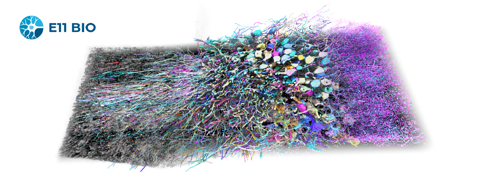

# e11-open-data

## Summary
This dataset was generated using E11.bio's PRISM technology (Protein Reconstruction and Identification through Multiplexing), a platform that combines viral barcoding, expansion microscopy, and iterative immunolabeling for large-scale neuronal reconstruction. Neurons were labeled with combinatorial “protein bits” that act as barcodes to distinguish individual cells and support error-correction during reconstruction. The dataset includes multiplexed imaging data, automated segmentations, and human proofreading annotations used to train machine learning models for morphology reconstruction and synaptic mapping.

## About

This dataset corresponds to the experiments described in the manuscript *Combinatorial protein barcodes enable self-correcting neuron tracing with nanoscale molecular context*. Neurons in the mouse hippocampal CA3 were transduced with a library of adeno-associated viruses (AAVs) encoding diverse “protein bits”—small epitope tags that act as combinatorial barcodes. Tissue was then processed with a modified expansion microscopy protocol, physically enlarging the sample ~5× to achieve an effective voxel size of ~35 × 35 × 80 nm. Across multiple cycles of staining, imaging, and antibody stripping, the same expanded tissue was repeatedly labeled, enabling iterative immunostaining for dozens of molecular targets.

The total volume spans ~10 million µm³ of hippocampal tissue and contains 23 distinct molecular channels, supporting automated reconstruction of neuronal morphology together with dense molecular and synaptic annotation.

## Data
All datasets are available via [AWS S3](https://aws.amazon.com/s3/) at 's3://e11bio-prism/ls'. 
### Images
Imaging data is stored in either [Zarr chunked array storage format](https://zarr.dev/) or neuroglancer precomputed format (optimized for viewing in [neuroglancer](https://github.com/google/neuroglancer))

#### Zarr format

"s3://e11bio-prism/ls/images/full_dataset.zarr"

| Data Group                                 | Scales                 | Type         | Data Type | Comments                                          |
| ------------------------------------------ | ---------------------- | ------------ | --------- | ------------------------------------------------- |
| all                       | 0,1,2,3,4,5            | Image        | uint8     | 40 channels, all barcodes + markers, unnormalized |
| raw                      | s0, s1, s2, s3, s4, s5 | Image        | uint8     | 18 channels, min/max normalized                   |
| markers                                    | s0, s1, s2, s3, s4, s5 | Image        | uint16    | 7 channels, unnormalized                          |
| barcode_mask                              | s0, s1, s2, s3, s4, s5 | Image        | uint8     |                                                   |
| dense_segmentation                         | s0, s1, s2, s3, s4, s5 | Segmentation | uint64    |                                                   |
| local_segmentation          | s0, s1, s2, s3, s4, s5 | Segmentation | uint64    | ~1500 skels                                                  |
| local_segmentation_spines    | s0, s1, s2, s3, s4, s5 | Segmentation | uint64    |    (10 skels to spines)                                                |
| proofread_segmentation         |                        | Segmentation | uint64    |                                                   |
| barcode_relabeled_segmentation |                        | Segmentation | uint64    |                                                   |

---
#### Neuroglancer Precomputed format

"s3://e11bio-prism/ls/images/full_dataset.zarr/precomputed/"

This data is a parallel of the data described in the table above but has been optimized for viewing in neuroglancer.

| Path                                   | Comments                                                                                       |
| -------------------------------------- | ---------------------------------------------------------------------------------------------- |
| raw                                    | Raw barcodes                                                                                   |
| enhanced                               | Enhanced barcodes                                                                              |
| markers\_all                           | Markers                                                                                        |
| combined\_affs                         | Combined affinities                                                                            |
| dense\_seg                             | Dense segmentation                                                                             |
| local\_seg\_full                       | Skeleton seeded segmentation (1500 skels not traced to spines)                                 |
| local\_seg\_spines                     | Skeleton seeded segmentation (10 skels traced to spines)                                       |
| pre\_mask\_dense\_seg                  | Presynaptic mask                               |
| post\_mask\_dense\_seg                 | Postsynaptic mask                            |
| pre\_mask\_local\_seg\_spines          | Presynaptic mask for local seg constrained to 1500 skeletons  |
| post\_mask\_local\_seg\_spines         | Postsynaptic mask for local seg constrained to 1500 skeletons |
| proofed\_cells                         | Proofread segments                                                                       |
| segments\_skeleton\_barcode\_relabeled | Barcode relabeled segmentation in eval roi                                                     |

#### Skeletons

"s3://e11bio-prism/ls/images/full_dataset.zarr/skeletons/"

Folder with manually annotated skeletons of axons and dendrites in the dataset. THese were used to generate some of the segmentation data described above. 

## Data Access
### Access Zarr data via S3
Accessing Zarr format data can be easily done using the Zarr python library

```python
# Open the Zarr array from S3
fs = s3fs.S3FileSystem(anon=True)
store = s3fs.S3Map("e11bio-prism/ls/models/training_data/instance/crop_0.zarr/raw", s3=fs)
# open zarr store.
arr = zarr.open(store, mode="r")
# See the array shape
print(arr.shape)
```

### Access via AWS cli
All data can be downloaded using the AWS CLI. See instructions here on how to install [AWS CLI V2](https://docs.aws.amazon.com/cli/latest/userguide/install-cliv2.html)


#### Examples
Listing all the files in the images directory

```bash
aws s3 ls s3://e11bio-prism/ls/images
```

Here is an example of downloading a downsampled version of all the synaptic marker imaging data.
```bash
aws s3 s3://e11bio-prism/ls/images/full_dataset.zarr/markers/s5/ . \
--recursive \
--no-sign-request
```

## Tutorials

* [Browsing and downloading data](tutorials/Browsing_and_downloading_data.ipynb)
* [Access_and_view_zarr_image_data](tutorials/Open_and_view_zarr_array.ipynb)


## License
[Creative Commons Attribution-ShareAlike 4.0 International (CC BY-SA 4.0)](https://creativecommons.org/licenses/by-sa/4.0/deed.en)
## Acknowledgements
E11 acknowledges the Eric and Wendy Schmidt Fund for Strategic Innovation, Riley and Susan Bechtel Foundation, Fickel Family Foundation, and Hearst Foundations. The Francis Crick Institute acknowledges Cancer Research UK (CC2168), the UK Medical Research Council (CC2168), the Wellcome Trust (CC2168), the Allen Distinguished Investigator Award, and the Harold J. Newman Brain Mapping Foundation. The Boyden lab acknowledges funding from Lisa Yang, HHMI, Schmidt Futures, the National Institutes of Health grants R01AG087374, 1R01EB024261, 1R01AG070831, 1R01MH123403, 1R01MH123977, Open Philanthropy, and Good Ventures.